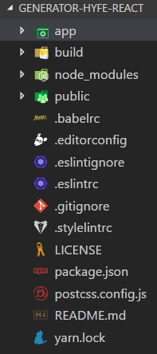
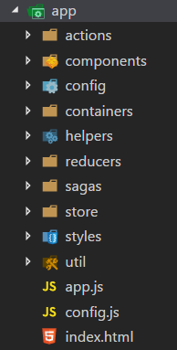

## 研发中心前端技术方案

### 目录

\* [1. 项目简介](#1、项目简介)

\* [2. 项目特色](#2、项目特色)

\* [3. 技术选型](#3、技术选型)

\* [4. 目录结构](#4、目录结构)

\* [5. 开发环境](#5、开发环境)

\* [6. 生成框架](#6、生成框架)

\* [7. 部署](#7、部署)

\* [8. 浏览器兼容](#8、浏览器兼容)

\* [9. 开发指南](#9、开发指南)

\* [10. 扩展功能点](#10、扩展功能点)

\* [11. 更新记录](#10、更新记录)

\* [12. 技术支持](#11、技术支持)

### 1、项目简介

从零开始创建一个新的项目是非常耗时的。作为开发人员，我们应该花费更多的时间来进行业务逻辑的开发，而不是配置项目环境，如配置webpack、eslint等，并且还要尽量避免由于某个包的版本不对导致的问题。generator-hyfe可以帮助开发人员轻松启动并运行，而无需担心构建配置问题，将开发人员从繁琐的项目配置和构建中解放出来，使其有更多的时间专注于业务的开发。

### 2、项目特色

- 支持多开发环境：开发、测试和线上；
- 统一的编码规范；
- 统一的目录结构；
- 统一的处理流程：异步请求、事件处理；
- 支持Mock数据；
- 前沿的技术栈。

### 3、技术选型

- es6/7/next：使用JavaScript语言的最新特性；
- react：构建用户界面；
- redux：数据流管理；
- webpack：资源加载打包；
- react-router：路由管理；
- redux-saga：处理异步请求；
- sass：CSS预处理器；
- react-intl：国际化；
- react-loadable：按需加载组件；
- loadsh：工具集；
- axios：发送网络请求；
- mockjs：模拟数据；
- d3.js：绘制个性化图表或关系图；
- echarts/zrender：基础图表或特殊图表；
- eslint：检查前端编码规范。

### 4、目录结构

	

### 5、开发环境

\* []()

\* []()

\* []()

### 6、生成框架

#### 6.1 通过Gitlab获取

说明：暂时通过重庆前端Gitlab获取，后续会迁移到南京统一开发环境上面。

```
$ git clone http://192.168.1.11/hyfe/generator-hyfe-react.git

$ cd < project name >

$ yarn install

$ yarn run start

Server is now running at http://localhost:3000.
```

#### 6.2 通过脚手架生成

说明：2018年3月15日之前建议使用[6.1](#6.1) 方式获取，脚手架目前正在优化中。

```
$ yarn add generator-hyfe

$ yo generator-hyfe

$ choose generator-hyfe-react

$ cd < project name >

$ yarn install

$ yarn run start

Server is now running at http://localhost:3000.
```

### 7、部署

#### 7.1 修改静态服务器地址

`build/config/project.config.js`

```
 // ----------------------------------
  // Server Configuration
  // 部署服务器地址和端口
  // ----------------------------------
  server_host : 'localhost',
  server_port : process.env.PORT || 3000,
```

修改以上`server_host`和`server_port`字段，这两个字段对应的是访问静态资源（JS、CSS和图片等）的地址和端口。

#### 7.2 修改访问接口地址

详见[9.1.3](#9.1.3) 。

#### 7.3 打包

运行`[npm | yarn] run deploy:prod`或`[npm | yarn] run deploy:dev`创建一个 `dist`目录，其中包含应用程序编译后的版本 。访问根目录下的`index.html`，应用程序将被加载。

- `[npm | yarn] run deploy:dev`：打包后的文件不会压缩，便于在线调试；
- `[npm | yarn] run deploy:prod`： 打包后的文件已压缩，用于部署。

### 8、浏览器兼容

\* Chrome

\* Mozilla

\* Safari

### 9、开发指南

开发过程中目录结构必须统一，下面从一级目录和app目录下的二级目录层面分别进行介绍。

一级目录：

| 目录名    | 作用      | 备注           |
| ------ | ------- | ------------ |
| app    | 源码      |              |
| build  | 打包编译的脚本 |              |
| dist   | 打包后的文件  | 使用该文件夹中的内容部署 |
| public | 公用静态资源  | 一般不用         |

app目录下的二级目录：

| 目录/文件       | 作用                          | 备注                                |
| ----------- | --------------------------- | --------------------------------- |
| actions     | 动作触发的actions                | 每个action都是纯函数，不涉及网络请求等副作用         |
| components  | 展示组件                        | 仅负责展示，数据通过containers中组件传递         |
| config      | 配置项                         | 全局配置项和合并的子模块配置项                   |
| containers  | 容器组件                        | 具有业务逻辑的组件                         |
| reducers    | 接收action和新state，返回处理后的state |                                   |
| sagas       | 业务逻辑、网络请求处理和Mock数据          | 区别于redux-thunk，统一使用saga管理异步请求     |
| store       | 统一的数据源                      | 加入了redux-saga、redux-logger等中间件的处理 |
| style       | 公用样式文件                      | 各子模块样式文件遵循就近原则，和各自组件放到一起          |
| util        | 工具类                         | 国际化、提前加载、页面缩放、创建action、封装请求等      |
| util.loader | 页面渲染前提前加载内容                 | 提前加载的内容分为子模块配置项和Mock数据            |
| util.zoom   | 页面缩放功能                      | 按照比例对页面进行缩放                       |
| app.js      | 应用程序主入口文件                   |                                   |
| index.html  | 应用程序HTML文件                  |                                   |

#### 9.1 开发环境配置

修改`app/config/base.config.js`。

##### 9.1.1 开启mock数据支持

```
// 是否使用mock模式，在mock模式下向服务器的请求被mockjs拦截
mock: true, // search.indexOf('mock') !== -1,
// 是否使用proxy模式，在proxy模式下会使用proxy的url来替换原来的url
proxy: false
```

##### 9.1.2 切换到联调模式

```
// 是否使用mock模式，在mock模式下向服务器的请求被mockjs拦截
mock: false, // search.indexOf('mock') !== -1,
// 是否使用proxy模式，在proxy模式下会使用proxy的url来替换原来的url
proxy: true,
```

##### 9.1.3 切换到部署模式

```
// 是否使用mock模式，在mock模式下向服务器的请求被mockjs拦截
mock: false, // search.indexOf('mock') !== -1,
// 是否使用proxy模式，在proxy模式下会使用proxy的url来替换原来的url
proxy: false,
```

#### 9.2 初始化操作

在项目入口文件`app.js`中，通过以下操作：

```
// 渲染前处理
import preLoader from '@/helpers/preloader'
import mockAPI from '@/sagas/mockIndex'

// ========================================================
// Mock & Config Setup
// 渲染前设置配置项和mock API，config为子模块配置项
// ========================================================
preLoader.load({
  config: {},
  apis: mockAPI
})
```

实现在渲染页面之前，加载各个子模块的配置项和开启Mock数据。

#### 9.3 异步请求

所有的异步请求都经过了一层封装，使用方式如下：

```
/**
 * @description 使用github API获取用户信息
 * @param {string} username 用户名
 * @param {number} page 当前页数
 * @return {promise} 返回结果的Promise
 */
const apifetchUser = (username, page) => {
  return fetch('fetchUserList', {
    username,
    page
  })
}
```

说明：

- `fetchUserList`对应mock文件export的名称，文件路径`app/sagas/mockIndex.js`；

  ```
  import fetchUserList from './user/userList'

  export default {
    fetchUserList
  }
  ```

#### 9.4 Mock数据

通过使用Mock数据，便于前端离线开发或联调。

`app/sagas/user/userList.js`

```
/*
 * @Author: baizn 
 * @Email: baizhanning@hiynn.com 
 * @Description: 获取用户列表mock数据
 * @Date: 2018-02-12 11:11:18 
 * @Last Modified by: baizn
 * @Last Modified time: 2018-02-12 11:41:35
  */
  
export default {
  url: '/user/:list',
  mock: {
    'code': 1,
    'msg': 'success',
    'result|10-15': [
      {
        'id|5-10': 100,
        'detail|3-5': '@cname'
      }
    ]
  }
}
```

#### 9.5 业务逻辑处理

所有业务逻辑的处理都统一在`saga`中处理，如下所示：

`app/sagas/user/userSaga.js`

```
import { call, put, take } from 'redux-saga/effects'
import { fetch } from '@/util/request'

import { 
  LOAD_USER_REQUEST, 
  loadUserSuccess, 
  loadUserFailed } from '@/actions/userAction'

/**
 * @description 使用github API获取用户信息
 * @param {string} username 用户名
 * @param {number} page 当前页数
 * @return {promise} 返回结果的Promise
 */
const apifetchUser = (username, page) => {
  return fetch('fetchUserList', {
    list: 'xxx'
  })
}

/**
 * @description 获取用户信息
 * @param {object} action action类型
 */
export function* fetchUser(action) {
  try {
    const { username, page } = yield take(LOAD_USER_REQUEST, fetchUser)
    const user = yield call(apifetchUser, username, page)
    yield put(loadUserSuccess(user.data))
  } catch (error) {
    yield put(loadUserFailed(error.message))
  }
}
```

### 10、扩展功能点

- React与D3结合，实现让D3操作虚拟DOM，计划于20180320之前完成；
- React与echarts、zrender结合，所有绘制在虚拟DOM上面进行。

### 11、更新记录

- 20180307-搭建开发框架，统一框架规范。

### 12、技术支持

- 海云数据研发中心平台前端组

